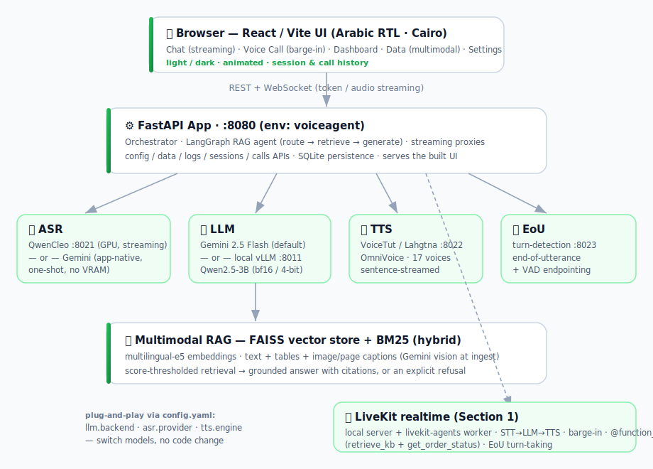

<div align="center">

# 🗣️ Voice Agent — Configurable Arabic ASR → LLM → TTS with Multimodal RAG

**A production-style, fully configurable Arabic voice assistant.**
Speak or type in Egyptian Arabic; the agent retrieves from your documents, answers with citations,
refuses out-of-scope questions, and talks back — with barge-in and real-time turn-taking.

Built as the **Electro-Pi AI-Engineer technical test** (LiveKit · LangChain/RAG · Quantization · Deployment)
**and** a real, shippable product on top of it.

`FastAPI` · `React/Vite` · `LangGraph` · `FAISS + BM25` · `Gemini / vLLM` · `QwenCleo ASR` · `OmniVoice TTS` · `LiveKit`

</div>

---

## 📑 Table of contents

- [What it does](#-what-it-does)
- [System architecture](#-system-architecture)
- [Prerequisites](#-prerequisites)
- [Step-by-step installation](#-step-by-step-installation)
- [Running the system](#-running-the-system)
- [Configuration (`config.yaml`)](#-configuration-configyaml)
- [Switching models (plug-and-play)](#-switching-models-plug-and-play)
- [Using the app](#-using-the-app)
- [How it works](#-how-it-works)
- [Test-assignment section mapping](#-test-assignment-section-mapping)
- [Pros, cons & limitations](#-pros-cons--limitations)
- [Repository layout](#-repository-layout)
- [Sub-READMEs](#-sub-readmes)

---

## ✨ What it does

| Capability | Detail |
|---|---|
| 🧑‍🍳 **Configurable agent** | Name + purpose category (restaurant, customer-service, healthcare, education) each mapped to a detailed Arabic system prompt, or **"Other"** with an LLM-suggested prompt. |
| 📄 **Multimodal RAG** | Ingest `txt / md / docx / pdf` — **text, tables, and images/pages** are captioned (Gemini vision), chunked, embedded (multilingual-e5) into **FAISS**, retrieved with **hybrid dense + BM25**. |
| 💬 **Streaming chat** | True token streaming, visible **tool calls**, retrieved-document cards with page previews, out-of-scope **refusal**, Egyptian-dialect answers, English numerals for correct TTS. |
| 🎙️ **Voice chat** | Record a message → transcribe → answer → 🔊 listen. Gemini ASR transcribes the whole clip **once** (no hallucination); QwenCleo **streams** live. |
| 📞 **Real-time call** | Full-screen animated call (LiveKit-style) with **barge-in** (interrupt the agent mid-sentence), VAD + Arabic **end-of-utterance**, mixed-audio recording, **sentence-streamed** TTS for low latency. |
| 🧠 **Conversation memory** | Remembers what you said earlier ("انا اسمي محمد" → "انا اسمي ايه؟" → *"اسمك محمد"*) without hitting the KB. |
| 🔌 **Plug-and-play** | Swap **LLM** (Gemini ↔ local vLLM), **ASR** (QwenCleo ↔ Gemini), **TTS** (VoiceTut ↔ Lahgtna) from `config.yaml` or the Settings tab — **no code changes**. |
| 📊 **Dashboard** | Session & call history, recorded-call playback (wavesurfer), per-query agent activity with latencies, detailed `.log` files. |
| 🎨 **Modern UI** | Arabic RTL, Cairo font, light/dark toggle, animated, collapsible sidebars. |

---

## 🗺️ System architecture



Everything is a small, independently-runnable service so heavy models can live in their own conda
env / GPU slice. The **app** (Gemini + RAG) runs on its own; the **voice** services (ASR/TTS/EoU) are
optional and only loaded when you need them.

---

## 🧰 Prerequisites

- **OS:** Linux (developed on WSL2). macOS works for the Gemini-only path (no local GPU models).
- **GPU:** NVIDIA, CUDA 12.x driver (e.g. 535+). Reference box: **RTX 4060 Ti 16 GB**.
  Gemini-only mode needs **no GPU**.
- **conda** (Miniconda/Anaconda) and **Node 18+** (to build the UI).
- **A Gemini API key** (default LLM + optional ASR + ingest vision).

> 💡 **Fastest path:** with just a Gemini key you can run **chat + RAG + voice (Gemini ASR)** with
> **no local models and no GPU**. The local LLM / QwenCleo / OmniVoice are opt-in.

---

## 📦 Step-by-step installation

### 0️⃣ Clone the repository

```bash
git clone https://github.com/MohammedAly22/RAG-VoiceAgent.git
cd RAG-VoiceAgent
```

### About the conda environments

The stack uses **separate conda envs** on purpose: vLLM/QwenCleo and VoiceTut pin **incompatible
torch builds**, and Node is kept out of the Python envs entirely. Only `voiceagent` + `node-env`
are needed for the default (Gemini) path.

| env | Python / Node | GPU? | Runs | Required? |
|---|:--:|:--:|---|:--:|
| **`voiceagent`** | Python 3.11 | no | FastAPI app · LangGraph RAG · ingestion · EoU · LiveKit worker | ✅ **required** |
| **`node-env`** | Node 20 | no | building / dev-serving the React UI | ✅ **required** (to build the UI) |
| **`omnivoice`** | Python 3.10 | yes | **TTS** (VoiceTut / OmniVoice, 17 voices) | optional (spoken output) |
| **`test-qwen`** | Python 3.12 | yes | QwenCleo **ASR** · local **vLLM** LLM · quantization benchmark | optional (local models) |

> **Don't have conda?** Install Miniconda first:
> ```bash
> wget https://repo.anaconda.com/miniconda/Miniconda3-latest-Linux-x86_64.sh
> bash Miniconda3-latest-Linux-x86_64.sh      # then restart your shell
> conda --version                              # verify
> ```
> Check your CUDA driver (for the GPU envs): `nvidia-smi` should report **CUDA 12.x** (driver 535+).

---

### 1️⃣ App env `voiceagent` (required)

```bash
# create + activate
conda create -n voiceagent python=3.11 -y
conda activate voiceagent

# install app + RAG + agent + ingestion deps (CPU-only; no torch/GPU needed here)
pip install -r requirements/voiceagent.txt

# sanity check
python -c "import fastapi, langgraph, faiss, sentence_transformers, google.genai; print('voiceagent env OK')"
```

**What this env contains:** FastAPI/uvicorn/websockets, LangGraph + langchain-core,
google-genai (Gemini LLM/ASR/vision), faiss-cpu, sentence-transformers (multilingual-e5
embeddings), rank-bm25, the document loaders (pypdf, pdfplumber, python-docx, pymupdf, pillow),
and the LiveKit agent packages. Full list + rationale in
[`requirements/voiceagent.txt`](requirements/voiceagent.txt).

### 2️⃣ Gemini key + `.env`

```bash
cp .env.example .env
# then edit .env and set your key:
#   GEMINI_API_KEY=your_key_here
```

Get a key at **https://aistudio.google.com/app/apikey**. This one key powers the default LLM,
the (optional) Gemini ASR, and the multimodal vision-captioning at ingest.

### 3️⃣ Build the UI (create the `node-env` conda env)

The React UI is built with **Node 20**, kept in its **own conda env** called `node-env`
(the build/dev scripts look for exactly this env). Create it once:

```bash
conda create -n node-env nodejs=20 -y
```

Then build — no need to `conda activate` it; `scripts/build_ui.sh` finds `node-env` automatically
and **auto-installs** the npm dependencies (incl. `vite`) on first run:

```bash
bash scripts/build_ui.sh           # → frontend-react/dist (served by the app at :8080)
```

> - The repo does **not** ship `node_modules` (it's gitignored), so the first build downloads UI
>   deps — normal, happens once.
> - Prefer `nvm` or system Node instead of a conda env? That works too — the scripts fall back to
>   any `node` on your `PATH` if `node-env` doesn't exist.
> - Hot-reload dev server (optional): `bash scripts/dev_ui.sh`.

### 4️⃣ Knowledge base — ingested automatically ✨

**No manual step needed.** On its **first launch**, the app auto-ingests the seed documents in
`data/kb/` (the Abou El Sid restaurant pack — 3 Markdown files + a PDF) into the FAISS index. After
that you add/remove documents live from the **Data** tab in the UI (drag-and-drop → chunk → embed).

> - First ingest downloads the `multilingual-e5-small` embedder (~120 MB). If the download is flaky,
>   run `bash scripts/prepare_embedder.sh` first (retries + mirror fallback).
> - Prefer to (re)build the index from the CLI? It's still available: `bash scripts/ingest.sh [path…]`.

✅ **At this point the default stack works** — start the app and it ingests the KB itself; you get
chat + RAG + voice-via-Gemini, no GPU. Jump to [Running the system](#-running-the-system). The next
two envs are only for local models.

---

### 5️⃣ (Optional) Voice env `omnivoice` — local TTS

```bash
conda create -n omnivoice python=3.10 -y
conda activate omnivoice

# GPU torch FIRST (CUDA 12.8 wheels), then the TTS package
pip install torch==2.8.0 torchaudio==2.8.0 --index-url https://download.pytorch.org/whl/cu128
pip install -r requirements/omnivoice.txt
pip install "websockets>=12"       # ⚠️ REQUIRED — uvicorn silently 404s WS routes without it

# sanity check
python -c "import torch, voicetut_tts; print('omnivoice OK · CUDA:', torch.cuda.is_available())"
```

### 6️⃣ (Optional) Local-model env `test-qwen` — QwenCleo ASR + vLLM + quantization

```bash
conda create -n test-qwen python=3.12 -y
conda activate test-qwen

# GPU torch FIRST (CUDA 12.8 wheels), then vLLM/ASR/quantization deps
pip install torch==2.9.1 --index-url https://download.pytorch.org/whl/cu128
pip install -r requirements/test-qwen.txt
pip install "websockets>=12"

# sanity check
python -c "import torch, vllm, bitsandbytes; print('test-qwen OK · CUDA:', torch.cuda.is_available())"
```

> 📌 **Exact pinned versions** for reproducibility are in
> [`requirements/test-qwen.freeze.txt`](requirements/test-qwen.freeze.txt) and
> [`requirements/omnivoice.freeze.txt`](requirements/omnivoice.freeze.txt) — install with
> `pip install -r requirements/<env>.freeze.txt` if you hit a version conflict.

> 🧠 **VRAM note (single 16 GB GPU):** loading QwenCleo ASR **+** OmniVoice TTS **+** a local
> LLM at once is tight. Recommended combos: *Gemini LLM + local ASR/TTS*, **or** *local vLLM
> alone*. Keep `asr.provider: gemini` to save ~2–3 GB when you don't need local ASR.

### 🐳 (Optional) Local LLM via Docker (Section 4)

No conda needed — serve Qwen2.5-3B with vLLM (OpenAI-compatible, streaming):

```bash
docker build -t voiceagent-llm -f deployment/Dockerfile .
docker run --gpus all -p 8011:8011 voiceagent-llm
```
Then set `llm.backend: vllm` in `config.yaml`. See [`deployment/`](deployment/).

---

## 🚀 Running the system

All services are launched via `scripts/` (tmux windows). Pick a mode:

```bash
bash scripts/start_all.sh          # app only  → chat + RAG + Gemini voice (no GPU services)
bash scripts/start_all.sh voice    # app + TTS + EoU (+ QwenCleo ASR only if selected in config)
bash scripts/start_all.sh full     # + LiveKit server & agent worker

bash scripts/status.sh             # health of every service
bash scripts/stop_all.sh           # stop everything
```

Then open **http://127.0.0.1:8080**.

> 🧠 **Smart loading:** `start_all.sh voice` reads `asr.provider`. With `gemini`, the QwenCleo
> service is **skipped** (transcription is app-native — saves ~2–3 GB VRAM). With `qwencleo` it's
> launched. You can flip providers live in **Settings** (it tells you to run `scripts/start_asr.sh`).

Run a single service directly: `scripts/start_app.sh`, `start_tts.sh`, `start_asr.sh`, `start_eou.sh`, `start_llm.sh`.

---

## ⚙️ Configuration (`config.yaml`)

One file drives the whole system. Key blocks:

```yaml
agent:                     # the persona
  name: مساعد مطعم المصري الاصيل
  category: restaurant     # → picks the system prompt from `categories:` below
  system_prompt: "..."     # effective persona (editable in the Setup wizard)
  greeting: "..."

llm:
  backend: gemini          # gemini | vllm      ← switch the language model
  temperature: 0.3
  max_tokens: 1024
  gemini: { model: gemini-2.5-flash }
  vllm:                    # local server (Section 4)
    model_path: Qwen/Qwen2.5-3B-Instruct
    served_model_name: voiceagent-llm
    quantization: null     # null (bf16) | bitsandbytes (4-bit)
    gpu_memory_utilization: 0.55
    base_url: http://127.0.0.1:8011/v1

rag:
  embedding_model: intfloat/multilingual-e5-small
  vector_store: faiss
  top_k: 5
  score_threshold: 0.3     # below this → "no relevant context" → refuse
  hybrid: true             # dense + BM25
  multimodal: true         # caption tables/images at ingest

asr:
  provider: gemini         # gemini (app-native, one-shot) | qwencleo (local, streaming)
  gemini_model: gemini-2.5-flash
  model_id: mohammedaly22/QwenCleo-ASR
  silence_rms: 0.008       # server-side silence gate (anti-hallucination)

tts:
  engine: lahgtna          # voicetut | lahgtna
  active_voice: Sayed
  num_step: 16             # diffusion steps — THE latency/quality knob (lower = faster)

eou:
  enabled: true
  threshold: 0.55          # end-of-utterance probability to end a turn

categories: [ ... ]        # id → label → detailed Arabic system prompt
```

Saving from the **Settings** tab hot-swaps the config in place — no restart needed for
LLM/ASR/TTS/voice changes.

---

## 🔌 Switching models (plug-and-play)

| To switch… | Set in `config.yaml` (or Settings tab) | Notes |
|---|---|---|
| **LLM → local** | `llm.backend: vllm` | Start it: `scripts/start_llm.sh` (env `test-qwen`). |
| **LLM → Gemini** | `llm.backend: gemini` | Default. Needs `GEMINI_API_KEY`. |
| **ASR → Gemini** | `asr.provider: gemini` | App-native, one-shot per clip, no VRAM. |
| **ASR → QwenCleo** | `asr.provider: qwencleo` | Local streaming. Run `scripts/start_asr.sh` (loads on VRAM). |
| **TTS → Lahgtna / VoiceTut** | `tts.engine: lahgtna\|voicetut` | Both served by the TTS service. |
| **TTS voice** | `tts.active_voice: <name>` | Preview voices in Settings. |
| **Quantize local LLM** | `llm.vllm.quantization: bitsandbytes` | 4-bit NF4 — see [Quantization](quantization/results/RESULTS.md). |

The interface layer (`backend/agent/llm.py`) exposes one `astream_tokens()` regardless of backend,
so the agent, chat, and voice paths are identical whether you're on Gemini or a local model.

---

## 🖱️ Using the app

1. **Setup wizard** (first run) — name the agent, pick a category (or *Other* → LLM-suggested prompt), upload docs.
2. **Chat** — type or 🎙️ record; watch the `retrieve_kb` tool fire, see source cards, hit **استمع** to hear the reply.
3. **Voice Call** — press the green call button; talk naturally, **interrupt** the agent any time; end to save the recording.
4. **Data** — filter by type, preview PDFs/pages/tables, semantic-search the KB, drag-drop new files.
5. **Dashboard** — sessions, calls (with playback), and agent activity with latencies.
6. **Settings** — swap LLM / ASR / TTS / voice live.

---

## 🧩 How it works

**RAG agent** (`backend/agent/graph.py`) — a low-latency single-pass **route → retrieve → generate**:

- **Route** — greetings/thanks answer from the persona; questions about the conversation ("what's my
  name?") answer from **memory**; everything else retrieves.
- **Retrieve** — hybrid FAISS + BM25, score-thresholded; emitted to the UI as a visible tool call.
- **Generate** — one **streaming** grounded call; citations appended (and stripped before TTS);
  explicit refusal when nothing relevant is found.

**Voice pipeline** — VAD-gated mic → ASR (streaming QwenCleo / one-shot Gemini) → EoU → agent (streaming
tokens) → **sentence-by-sentence TTS** (audio starts on the first sentence). Barge-in cancels the agent
and re-opens the mic instantly.

See [`backend/agent/README.md`](backend/agent/README.md) for the agent design + tool-flow diagram, and
[`backend/README.md`](backend/README.md) for the service map.

---

## 🎓 Test-assignment section mapping

| PDF Section | Where | What |
|---|---|---|
| **1 · LiveKit realtime (20+5)** | `backend/realtime/agent.py` | `AgentSession` STT→LLM→TTS, `Agent` persona, `@function_tool` (`retrieve_kb`, mock `get_order_status`), barge-in + EoU, transcript log. **Bonus:** TTS/ASR swap via config. |
| **2 · RAG (20)** | `backend/rag/`, `agent/graph.py` | FAISS chunk/embed, citations to source chunk, score-threshold refusal, hybrid + multimodal. |
| **3 · Quantization (20)** | `quantization/` | Qwen2.5-3B **bf16 vs 4-bit NF4** on **real restaurant prompts** — VRAM / TTFT / throughput + quality, vs Gemini. → [`quantization/results/RESULTS.md`](quantization/results/RESULTS.md). |
| **4 · Deployment (25)** | `deployment/` | vLLM (OpenAI-compatible, **streaming**) + **Dockerfile** + load test (TTFT + 10-concurrent). → [`deployment/results.md`](deployment/results.md). |

### 📈 Real measured results (this repo)

Restaurant Q&A, RTX 4060 Ti 16 GB — from `quantization/results/RESULTS.md`:

| Backend | Peak VRAM | Avg TTFT | Throughput | Quality note |
|---|---|---|---|---|
| **Gemini 2.5 Flash** (default) | 0 (cloud) | **0.58 s** | streamed | Best; follows English-numeral + citation rules; most accurate. |
| **Local Qwen2.5-3B bf16** | 6.53 GB | 0.92 s | 10.9 tok/s | Good, but occasional price slip + Arabic numerals. |
| **Local Qwen2.5-3B 4-bit NF4** | **2.45 GB** | 0.73 s | 4.8 tok/s | **−62 % VRAM** (co-resident with ASR+TTS); lower fidelity. |

**Takeaway:** Gemini is the product default (quality + latency, zero VRAM). Local 4-bit exists for
offline/on-prem and to fit the LLM *alongside* the voice models on one 16 GB card.

---

## ⚖️ Pros, cons & limitations

### ✅ Strengths
- **End-to-end streaming** ASR → LLM → TTS; TTS starts on the first sentence → low perceived latency.
- **Truly configurable** — persona, category, models, voices all data-driven; no code edits to reconfigure.
- **Grounded & safe** — hybrid retrieval, score-thresholded refusal, citations, no hallucinated prices.
- **Multimodal ingest** — tables and images/pages are understood (vision captions) and previewable.
- **Barge-in + Arabic EoU** for natural turn-taking; VAD prevents silence hallucinations.
- **Two deployment modes** — cloud (Gemini, zero VRAM, best quality/latency) or fully local/on-prem.

### ⚠️ Limitations (honest)
- **16 GB single GPU** can't host a 30B model locally; the local path uses **Qwen2.5-3B**. Running
  vLLM + ASR + TTS **all at once** is tight — documented; Gemini + voice services is the comfortable combo.
- **vLLM on WSL2** mis-profiles KV-cache VRAM (a known WSL quirk) → the portable
  `deployment/serve.py` (transformers, streaming) is used for load numbers on this box; the vLLM
  **Dockerfile** is the production path on a native Linux GPU host.
- **Gemini ASR** is one-shot per utterance (best quality, no hallucination) but adds a cloud round-trip;
  QwenCleo streams locally but is heavier on VRAM.
- **EoU** currently informs/logs turn decisions; the client VAD still drives turn-ending (documented).
- Local **Qwen2.5-3B** is weaker than Gemini on nuanced Arabic and instruction-following (see the
  quantization report — e.g. it sometimes emits Arabic-Indic numerals despite the English-numeral rule).

---

## 🗂️ Repository layout

```
voiceagent/
├── README.md · NOTES.md · config.yaml · .env(.example)
├── requirements/            voiceagent · test-qwen · omnivoice (+ .freeze)
├── scripts/                 env · start_*/stop/status · build_ui · ingest
├── backend/                 → backend/README.md
│   ├── app.py               FastAPI: UI + REST + WS chat/asr/tts + config/data/logs
│   ├── config.py · db.py · logging_setup.py · asr_gemini.py
│   ├── agent/               → backend/agent/README.md  (graph, llm, personas, tools)
│   ├── rag/                 ingest · store · multimodal
│   ├── services/            asr_service · tts_service · eou_service
│   └── realtime/            LiveKit agent worker (Section 1)
├── frontend-react/          React/Vite UI (pages, lib/voice.js, theme.css)
├── quantization/            Section 3 — build_prompts · benchmark · gemini · report
├── deployment/              Section 4 — serve.py · Dockerfile · loadtest · results
├── assets/                  architecture.svg · agent_flow.svg
└── data/                    kb/ · vectorstore/ · pages/ · logs/ · voiceagent.sqlite
```

---

## 📚 Sub-READMEs

- 🧠 **[`backend/agent/README.md`](backend/agent/README.md)** — agent design, routing, tool communication (SVG), stack, limitations.
- 🛠️ **[`backend/README.md`](backend/README.md)** — every service, ports, how they're used, limitations.
- 📝 **[`NOTES.md`](NOTES.md)** — per-section write-ups (latency table, WSL gotchas, num_step trade-off, 50-user scaling plan).

---

<div align="center"><sub>Built for the Electro-Pi AI-Engineer test · Arabic-first · streaming-first · configurable-first.</sub></div>
