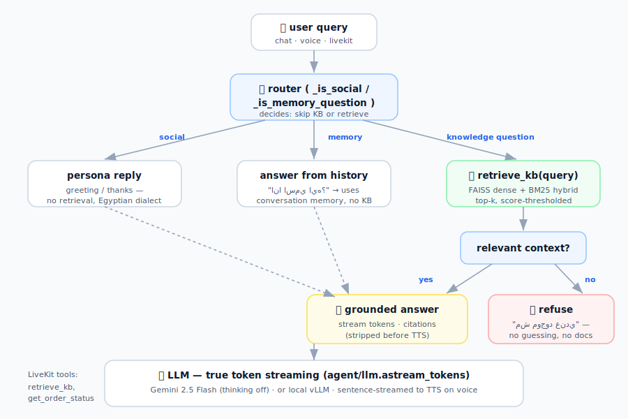

# 🧠 The RAG Agent — design, tools & flow

The agent turns a user turn (chat / voice / LiveKit) into a **grounded, streaming, Egyptian-Arabic**
answer — or an honest refusal. It is optimized for **low latency**: instead of a multi-round ReAct
loop, it does the classic RAG flow in a **single streaming pass**.

---

## 🔀 Routing — three paths, one that touches the KB

`stream_answer(query, history, channel)` first routes the turn (`graph.py`):

| Path | When | Behaviour |
|---|---|---|
| **Social** | greetings, thanks, small talk (`_is_social`) | Answer from the persona in one friendly line. **No retrieval.** |
| **Memory** | question about the conversation itself — the user's name, something said earlier (`_is_memory_question`, only when history exists) | Answer **from chat history**. **No retrieval.** e.g. `"انا اسمي ايه؟"` → *"اسمك محمد"*. |
| **Knowledge** | everything else | Emit a **`retrieve_kb`** tool call → hybrid search → grounded generation, or refuse. |

This is what keeps `"السلام عليكم"` and `"انا اسمي ايه؟"` from wastefully hitting (and being refused
by) the knowledge base.

---

## 🔧 Tools

| Tool | Where | What |
|---|---|---|
| `retrieve_kb(query)` | `agent/graph.py` (`_retrieve`) + `rag/store.py` | Hybrid **FAISS dense + BM25** search, `top_k`, **score-thresholded** (below `rag.score_threshold` → no context → refuse). Surfaced to the UI as a visible tool call, with source cards + page previews. |
| `get_order_status(order_id)` | `realtime/agent.py` | **Mock** second tool for the LiveKit agent (Section 1 "add a second tool" requirement). |

On the **chat/voice** surface the tools are orchestrated directly for speed; the **LiveKit** surface
(`realtime/agent.py`) exposes them as `@function_tool`s on an `AgentSession` (Section 1).

---

## ✍️ Generation

- **One streaming call** grounded on the retrieved context (`agent/llm.astream_tokens`).
- **Citations** are appended for chat and **omitted for voice** (they'd be read aloud); a sanitizer
  strips any residual `(المصدر: …)`, `[1]`, filenames, and converts **Arabic-Indic digits → ASCII**
  before TTS so numbers are voiced correctly.
- **Egyptian dialect** is enforced by `personas.GUARDRAILS` (بيك not بك, إزاي not كيف, English numerals…).
- **Refusal:** if there's no relevant context (or the model declines), the turn is marked `refused`,
  the doc cards are dropped, and it says *"مش موجود عندي"* instead of guessing.

---

## 🧱 Files

| File | Role |
|---|---|
| `graph.py` | Router + `retrieve → generate` streaming pipeline; `stream_answer` (UI events) / `answer_once` (CLI). |
| `llm.py` | **Plug-and-play** LLM: one `astream_tokens(system, history, user)` over **Gemini** (native streaming, thinking disabled) or **vLLM** (OpenAI-compatible). |
| `personas.py` | Category → system-prompt map, shared `GUARDRAILS`, `suggest_prompt()` for the "Other" flow. |
| `tools.py` | Tool definitions (retrieval + mock order status). |
| `logbus.py` | Structured per-query logs (events, timings, TTFT, retrieved, refusal) → Dashboard + `.log`. |

---

## 🧰 Stack

- **LangGraph / LangChain-core** — agent structure and message types.
- **google-genai** — Gemini streaming (LLM), ASR, and ingest vision.
- **FAISS + rank-bm25** — hybrid retrieval; **sentence-transformers** (`multilingual-e5-small`) embeddings.
- **vLLM / transformers** — the local LLM path (Section 3/4).

---

## ⚠️ Limitations

- **Heuristic routing.** `_is_social` / `_is_memory_question` are keyword/length heuristics, not an
  LLM classifier — cheap and fast, but they can occasionally misroute an unusual phrasing. The KB path
  has a history-aware fallback (it can still answer from the conversation before refusing), which
  softens misroutes.
- **Refusal relies on retrieval score + the model's grounded judgment.** Dense scores don't separate
  on/off-topic perfectly for short Arabic, so we trust the score threshold **and** the LLM's grounded
  refusal together.
- **Memory is per-session, in-context** (the message history passed each turn) — there's no long-term
  vector memory across sessions.
- **Local Qwen2.5-3B** follows the dialect/numeral/citation rules less reliably than Gemini
  (see `quantization/results/RESULTS.md`); Gemini is the recommended default for quality.
- **Single retrieval pass** (no query rewriting / multi-hop) — fast, but complex multi-part questions
  may retrieve less precisely than an iterative agent would.
